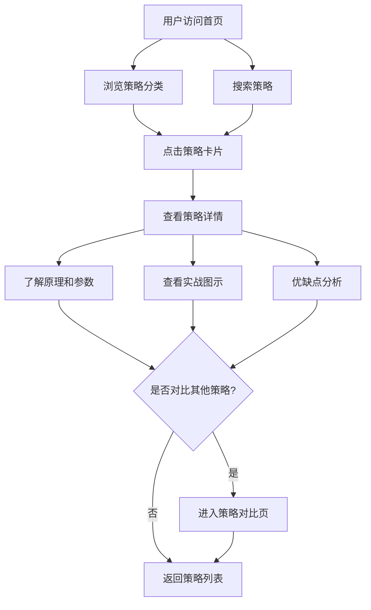

## 1. 产品概述

一个简约风格的股票技术分析策略展示网站，为投资者提供系统化的技术分析方法论和策略解读。目标用户为对股票技术分析感兴趣的个人投资者和交易者，帮助其快速理解和应用各类技术指标与交易策略。

## 2. 核心功能

### 2.1 用户角色
| 角色 | 注册方式 | 核心权限 |
|------|----------|----------|
| 访客 | 无需注册 | 浏览所有策略内容 |

### 2.2 功能模块
1. **首页**：Hero区域、策略分类导航、精选策略卡片列表、策略搜索
2. **策略详情页**：策略原理、参数说明、实战图示、优缺点分析、适用场景
3. **策略对比页**：多策略参数对比、适用市场环境对比

### 2.3 页面详情
| 页面名称 | 模块名称 | 功能描述 |
|----------|----------|----------|
| 首页 | Hero区域 | 展示网站核心理念，简约动态背景，标题和副标题 |
| 首页 | 策略分类导航 | 按类型分类：趋势型、震荡型、量价型、形态型 |
| 首页 | 策略卡片列表 | 展示策略名称、类型标签、简要描述、难度等级 |
| 首页 | 搜索筛选 | 按关键词、类型、难度筛选策略 |
| 策略详情页 | 策略原理 | 详细的技术分析原理说明 |
| 策略详情页 | 参数说明 | 核心参数及其含义、常用设置 |
| 策略详情页 | 实战图示 | 策略信号的可视化图表展示 |
| 策略详情页 | 优缺点分析 | 策略的优势与局限性 |
| 策略详情页 | 适用场景 | 适合的市场环境和时间周期 |
| 策略对比页 | 策略选择器 | 选择2-4个策略进行对比 |
| 策略对比页 | 对比表格 | 参数、信号、适用场景横向对比 |

## 3. 核心流程

用户访问首页 → 浏览策略分类/搜索 → 点击策略卡片进入详情 → 了解策略原理和参数 → 可选：跳转对比页进行多策略对比

## 4. 用户界面设计

### 4.1 设计风格
- **主色调**：深灰黑(#0D0D0D)为底，翡翠绿(#00C9A7)为点缀，暖白(#F5F5F0)为文字
- **辅助色**：琥珀黄(#F0B90B)用于警告/重要标记，淡灰(#2A2A2A)用于卡片背景
- **按钮风格**：圆角8px，微透明背景+边框，hover时填充色
- **字体**：标题使用 Playfair Display，正文使用 Noto Sans SC
- **布局风格**：顶部导航栏 + 内容区居中布局 + 卡片式策略展示
- **图标风格**：线性图标，1.5px描边，与文字同色

### 4.2 页面设计概述
| 页面名称 | 模块名称 | UI元素 |
|----------|----------|--------|
| 首页 | Hero区域 | 深色渐变背景，大标题居中，翡翠绿下划线装饰，轻微浮动动画 |
| 首页 | 分类导航 | 横向标签栏，选中态有翡翠绿底部指示条 |
| 首页 | 策略卡片 | 深灰卡片，左侧翡翠绿竖线装饰，hover时轻微上浮+阴影 |
| 首页 | 搜索栏 | 圆角输入框，搜索图标，半透明背景 |
| 策略详情页 | 原理区域 | 大段文字+关键指标高亮，引用块样式 |
| 策略详情页 | 参数表格 | 极简表格，翡翠绿表头，隔行变色 |
| 策略详情页 | 图示区域 | 暗色图表容器，模拟K线图样式 |
| 策略详情页 | 优缺点 | 双栏布局，左侧绿色优势，右侧黄色局限 |
| 策略对比页 | 策略选择器 | 标签选择，已选策略高亮 |
| 策略对比页 | 对比表格 | 横向对比，差异项高亮 |

### 4.3 响应式设计
- 桌面优先设计，最小宽度1280px为基准
- 平板端(768-1024px)：卡片改为2列，导航简化
- 移动端(<768px)：单列布局，汉堡菜单，卡片堆叠

### 4.4 策略内容规划

#### 趋势型策略
- **MACD策略**：双线交叉、零轴突破、顶底背离
- **均线策略**：金叉死叉、多头排列、均线支撑
- **布林带策略**：带宽收窄突破、轨道买卖、中轨支撑

#### 震荡型策略
- **RSI策略**：超买超卖、背离信号、中轴突破
- **KDJ策略**：金叉死叉、超买超卖、钝化识别
- **威廉指标**：超买超卖区间、穿越信号

#### 量价型策略
- **OBV策略**：能量潮趋势确认、量价背离
- **成交量策略**：放量突破、缩量回调、量价配合

#### 形态型策略
- **头肩形态**：头肩顶底识别、颈线突破
- **双底双顶**：W底M顶形态、确认条件
- **三角形态**：收敛三角、上升三角、下降三角
