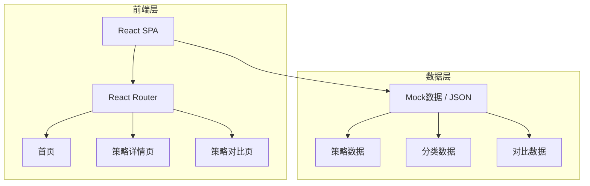
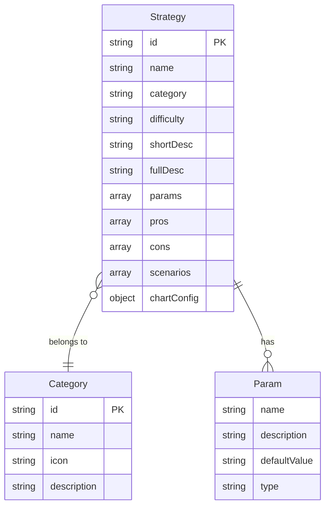

## 1. 架构设计



## 2. 技术说明
- **前端**：React@18 + Tailwind CSS@3 + Vite
- **初始化工具**：vite-init
- **后端**：无（纯前端项目，使用Mock数据）
- **数据库**：无（使用JSON静态数据）
- **路由**：react-router-dom@6
- **状态管理**：zustand
- **图标库**：lucide-react

## 3. 路由定义
| 路由 | 用途 |
|------|------|
| `/` | 首页，展示策略分类和卡片列表 |
| `/strategy/:id` | 策略详情页，展示单个策略完整信息 |
| `/compare` | 策略对比页，多策略横向对比 |

## 4. API定义
无后端API，所有数据使用前端Mock数据。

## 5. 数据模型

### 5.1 数据模型定义



### 5.2 数据定义

策略数据结构示例：
```typescript
interface Strategy {
  id: string;
  name: string;
  category: 'trend' | 'oscillator' | 'volume' | 'pattern';
  difficulty: 'beginner' | 'intermediate' | 'advanced';
  shortDesc: string;
  fullDesc: string;
  params: Param[];
  pros: string[];
  cons: string[];
  scenarios: string[];
  chartConfig: {
    indicators: string[];
    signalType: string;
  };
}

interface Param {
  name: string;
  description: string;
  defaultValue: string;
  type: 'number' | 'string' | 'select';
}

interface Category {
  id: string;
  name: string;
  icon: string;
  description: string;
}
```
